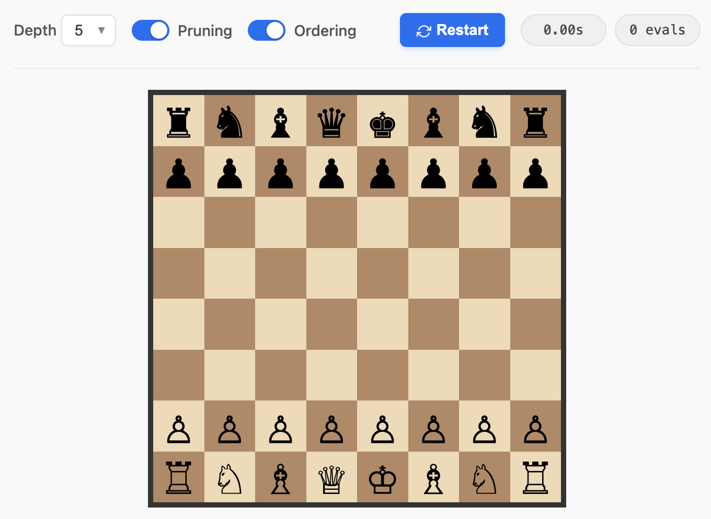

# Shannon's Minimax Chess Engine

A lightweight Python chess engine inspired by Claude Shannon's 1950 paper, "Programming a Computer for Playing Chess"

This project implements a Type A strategy (as defined by Shannon), utilizing a full-width Minimax search algorithm with a material-based evaluation function.

### Blog Post & Web Demo
**[Read the Article & Play the Engine](https://denizay.github.io/blog/chess.html)**

This repository serves as the educational reference for my [blog post](https://denizay.github.io/blog/chess.html) explaining the algorithm.

If you are looking for performance, the post features a "production-ready" version rewritten in **Rust** and compiled to **WebAssembly**. That version is significantly faster and includes **Alpha-Beta pruning** and **MVV-LVA** heuristics.

<a href="https://denizay.github.io/blog/chess.html">
  
</a>

## How to Run

No external dependencies are required. Just run the engine with Python 3:

```bash
python engine.py
```

### Simplified Rules

To focus on the algorithmic implementation, the game ends when a King is physically removed from the board.
